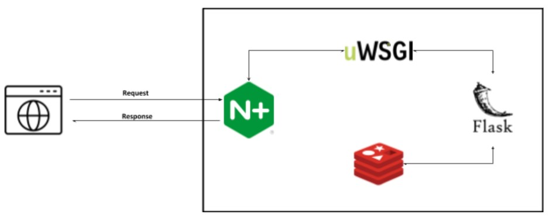

# ML Translator Assignment

## Table of contents
- [ML Translator Assignment](#ml-translator-assignment)
  - [Table of contents](#table-of-contents)
  - [General info](#general-info)
  - [Technologies](#technologies)
  - [High Level Architecture](#high-level-architecture)
  - [Algorithm](#algorithm)
  - [Contact](#contact)

## General info
A small web service for translating text from english to hebrew or hebrew to russian.

## Technologies
* [Flask](https://flask.palletsprojects.com/en/1.1.x/) (1.1.2)
* [nginx](https://nginx.org/en/docs/) (1.19.1)
* [uWSGI](https://uwsgi-docs.readthedocs.io/en/latest/) (2.0.19.1)
* [Redis](https://redis.io/documentation/) (6.0)
* [Docker](https://docs.docker.com/) (19.03.12)
* [Docker Compose](https://docs.docker.com/compose/) (1.26.2)

## High Level Architecture


## Algorithm
[Transformers](https://huggingface.co/transformers/) - State-of-the-art Natural Language Processing for Pytorch and TensorFlow 2.0

[MarianMTModel](https://huggingface.co/transformers/model_doc/marian.html#marianmtmodel) - Marian is an efficient Neural Machine Translation framework written in pure C++ with minimal dependencies.


[MarianTokenizer](https://huggingface.co/transformers/model_doc/marian.html#mariantokenizer) - tokenizing a text is splitting it into words or subwords, which then are converted to ids

## Prerequisites
* ```Ubuntu 18.04 (or higher)```
* Install ```docker compose``` from official [documentation](https://docs.docker.com/compose/install/).
* Install ```docker engine``` from official [documentation](https://docs.docker.com/engine/install/ubuntu/).

## Setup
```docker-compose up --build``` (might need root privileges, depending on the host machine)

## REST API
### Request

GET api/v1/translate?src=he&tgt=ru&text=<text_>
```
curl -i 'http://localhost:8000/api/v1/translate?src=he&tgt=ru&text=<text>'
```

### Request

GET api/v1/translate?src=en&tgt=he&text=<text_>

```
curl -i -H 'Accept: application/json' http://localhost:8000/api/v1/translate?src=en&tgt=he&text=<text>```
```


### Response
```
HTTP/1.0 200 OK
Content-Type: text/html; charset=utf-8
Content-Length: 6
Server: Werkzeug/0.16.1 Python/3.7.8
Date: Sat, 28 Nov 2020 22:45:10 GMT

<Translated text>
```

## Contact
Created by [Oded Ben Noon](oded282@gmail.com) - feel free to contact me!

## Comments
- This implementation runs on CPU. With small adjusments we could make it run on GPU and achieve better performance.

- Redis db is used as a cache. It means that every response the servers sends will be saved in db. Every following identical request will be responded from the db and wouldn't activate the algorithm.

- The srvers loads the models when it goes up. Therefore, it will take some time to start receving requests.